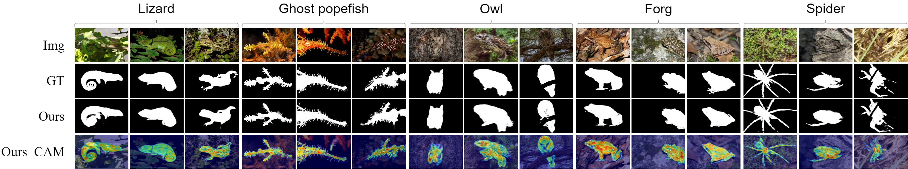
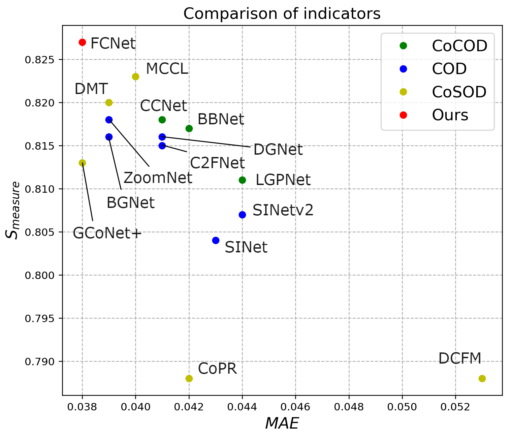

# Consensus-aware Foreground Refinement Network for Collaborative Camouflaged Object Detection (CFNet)

</a></h2>
Hongbo Bi, [Disen Mo](https://firefly-m.github.io/Moodysson.github.io/), Shiyuan Li, Cong Zhang*<br>

This is a code repository for the papar "Consensus-aware Foreground Refinement Network for Collaborative Camouflaged Object Detection" that submitted in *The Visual Computer* 2025.

Collaborative camouflaged object detection (CoCOD) aims at discovering the camouflaged objects in a group of relevant images.  Mining the camouflaged consistency relations across images is essential for locating collaborative camouflaged objects. The current CoCOD methods do not pay enough attention to the inclusion of information unrelated to co-significant objects in the common representation. Therefore, we propose a Consensus-Aware Foreground Refinement Network (CFNet) for collaborative camouflaged object detection.



<div align=center>

</div>


## 1. Training/Testing

The training and testing experiments are conducted using PyTorch with a single NVIDIA GeForce RTX 3080 GPU of 24 GB Memory.

1. Configuring your environment (Prerequisites):

```
Python==3.6.x
opencv-python==4.5.3.56
torch==1.12.0
```

- Creating a virtual environment in terminal: `conda create -n CFNet python=3.6`.
- Installing necessary packages: `pip install -r requirements.txt`.

2. Downloading necessary data:

- downloading testing dataset and move it into `./Dataset/`, which can be found in this [download link (Google Drive)](https://drive.google.com/file/d/1wyLfm0QhpOsgM5NoNcGCbgXnzQzBAJiX/view).

- downloading PvTv2 weights and move it into `./pth/backbone/pvt_v2_b2.pth`[download link (Google Drive)](https://drive.google.com/file/d/15D_GL4wY2oNzLvovCHg6aATVFWTezgtw/view?usp=sharing).

3. Training and Testing Configuration:

- All the parameters are saved in the `config.py` file and you can change them as needed, like `--pth/train_save` and `--pth/train_path` in `config.py`.

4. Training:

- After you set all the configuration in `config.py`, just run `train.py` to generate the weights of the model.

5. Testing:

- After you download all the pre-trained model and testing dataset, just run `test.py` to generate the final prediction map.

## 2. Datasets

Your dataset of test must conform to the following format:

```markdown
-- Dataset
  | -- Train
  |    | -- CoCOD
  |    | -- | img
  |    | -- | gt

  | -- Test
  |    | -- NC4K
  |    | -- | img
  |    |    | -- | class1
  |    |    | -- | class2
  |    | -- | gt
  |    |    | -- | class1
  |    |    | -- | class2
  
  |    | -- CHAMELEON
  |    | -- | img
  |    |    | -- | class1
  |    |    | -- | class2
  |    |    |    | -- | picture1.png
  |    |    |    | -- | picture2.png
  
  ...
    
  |    | -- | gt
  |    |    | -- | class1
  |    |    | -- | class2
  |    |    |    | -- | picture1.png
  |    |    |    | -- | picture2.png
  
  ...

```

## Citation

If you find our work to be beneficial to your research, please ensure to cite it in the journal once it has been accepted. We will promptly update and provide the appropriate citation format.

## Contact

If you have any questions, feel free to contact me via `modisen2022@163.com`.

We will release details about the code as soon as possible.
